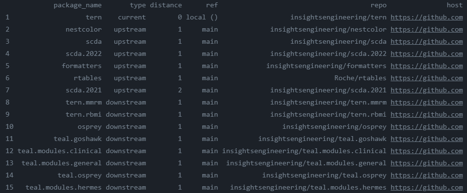

# Staged Dependencies Action

Github Action to install R package and system dependencies, based on the [`{staged.dependencies}`](https://github.com/openpharma/staged.dependencies) R package.

**NOTE**: For the time being, this action only supports installation of _system dependencies_ for Ubuntu OS. Other OSes will be supported upon request.

The [staged.dependencies] package simplifies the development process for developing a set of
interdependent R packages. In each repository of the set of R packages you are co-developing you should
specify a `staged_dependencies.yaml` file containing _upstream_ (i.e. those packages your current repo depends on) and
_downstream_ (i.e. those packages which depend on your current repo's package)
dependency packages within your development set of packages.

An example of the output of the action can be seen below:



## Table of Contents

- [Staged Dependencies Action](#staged-dependencies-action)
  - [Table of Contents](#table-of-contents)
  - [Getting Started](#getting-started)
  - [Usage Options](#usage-options)
    - [Inputs](#inputs)
    - [Outputs](#outputs)

## Getting Started

To get started, follow these instructions:

1. (Optional) Create `staged_dependencies.yaml` file with [this guide][structure-of-yaml-file].
2. Create a new file in your repository called `.github/workflows/r-check.yml`.
3. Copy the example workflow from below into that new file. Add additional configurations as needed.
4. Commit and push the `.github/workflows/r-check.yml` file to a new branch.
5. Open up a pull request and witness dependencies being installed during the workflow run.

```yml
---
name: Check R package

on:
  push:
    branches:
      - main
  pull_request:
    branches:
      - main

jobs:
  check:
    runs-on: ubuntu-latest
    name: Check
    container:
      image: rocker/verse:4.1.0
    steps:
      - name: Checkout repo
        uses: actions/checkout@v2

      - name: Run Staged dependencies
        uses: insightsengineering/staged-dependencies-action@v1
        with:
          run-system-dependencies: true
        env:
          GITHUB_PAT: ${{ secrets.GITHUB_TOKEN }}

      - name: Build R package
        run: |
          R CMD build ${{ github.event.repository.name }}
          echo "PKGBUILD=$(echo *.tar.gz)" >> $GITHUB_ENV
        shell: bash

      - name: Check R package
        run: R CMD check --no-manual ${{ env.PKGBUILD }}
        shell: bash

      - name: Install R package
        run: R CMD INSTALL ${{ env.PKGBUILD }}
        shell: bash
```

## Usage Options

The following options are available are available for this action:

<!-- BEGIN_ACTION_DOC -->
### Inputs

* `run-system-dependencies`:

  _Description_: Check for and install system dependencies

  _Required_: `false`

  _Default_: `false`

* `git-user-name`:

  _Description_: Git user.name configuration for fetching remote staged dependencies

  _Required_: `false`

  _Default_: `github-actions[bot]`

* `git-user-email`:

  _Description_: Git user.email configuration for fetching remote staged dependencies

  _Required_: `false`

  _Default_: `27856297+dependabot-preview[bot]@users.noreply.github.com`

* `path`:

  _Description_: Path to the R package

  _Required_: `false`

  _Default_: `.`

* `version`:

  _Description_: Version of {staged.dependencies} to use. This action is compatilble with `>=v0.2.2`

  _Required_: `false`

  _Default_: `v0.2.7`

* `threads`:

  *Description*: Number of threads to use. Set to 'auto' to use max available threads

  _Required_: `false`

  _Default_: `1`

* `cran-repos`:

  _Description_: Map of CRAN repositories delimited by comma

  _Required_: `false`

  _Default_: `CRAN=https://cloud.r-project.org`

* `enable-bioc-repos`:

  _Description_: Add `BiocManager::repositories()` to option repos

  _Required_: `false`

  _Default_: `false`

* `token-mapping`:

  _Description_: Token mapping that is used in `staged.dependencies.token_mapping` delimited by comma. Note that you will need to set these tokens with their respective values as environment variables while using this action.

  _Required_: `false`

  _Default_: `https://github.com=GITHUB_PAT,https://gitlab.com=GITLAB_PAT`

* `enable-check`:

  _Description_: Run `check_yamls_consistent` before installation of dependencies

  _Required_: `false`

  _Default_: `false`

* `git-ref`:

  _Description_: Git reference to use as a reference stage for installing dependencies

  _Required_: `false`

  _Default_: `${{ github.ref }}`

* `renv-restore`:

  _Description_: Restore dependencies from `renv.lock`, if it exists

  _Required_: `false`

  _Default_: `true`

* `quiet`:

  _Description_: Reduce logging

  _Required_: `false`

  _Default_: `true`

* `upgrade-remotes`:

    _Description_: Upgrades the 'remotes' R package to the edge version

    _Required_: `false`

    _Default_: `false`

* `direction`:

    _Description_: The direction to use to install dependencies. Choose between 'upstream', 'downstream' and 'all'

    _Required_: `false`

    _Default_: `all`

### Outputs

None
<!-- END_ACTION_DOC -->

[staged.dependencies]: https://github.com/openpharma/staged.dependencies
[structure-of-yaml-file]: https://github.com/openpharma/staged.dependencies#structure-of-staged_dependenciesyaml-file
